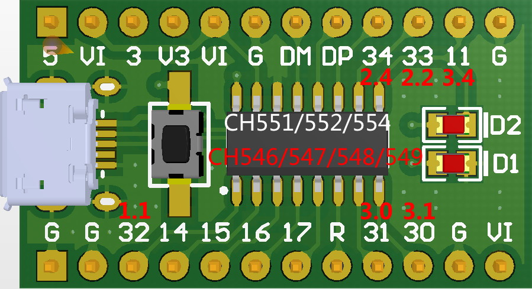

# CH552Nano

A low cost small size USB dev board based on WCH CH552G.

- [User Manual](DOC/CH552Nano用户手册v20.10.26.pdf)
- [Firmware](FW)

CH552G can be replaced by CH551G and CH554G, in fact these models have the same Die.

CH559G/CH558G/CH557G/CH556G can also be soldered on CH552Nano board. Six GPIOs will change in this case.

|  PIN  | CH552G | CH549G |
|:-----:|:------:|:------:|
|   1   |  P3.2  |  P1.1  |
|   7   |  P3.1  |  P3.0  |
|   8   |  P3.0  |  P3.1  |
|   9   |  P1.1  |  P3.4  |
|  10   |  P3.3  |  P2.2  |
|  11   |  P3.4  |  P2.4  |

